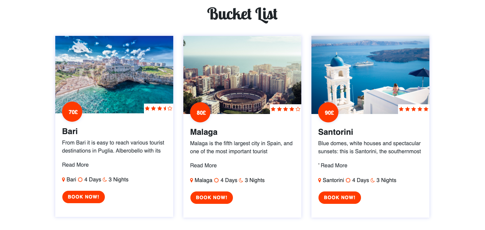
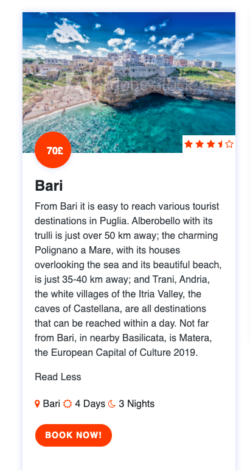
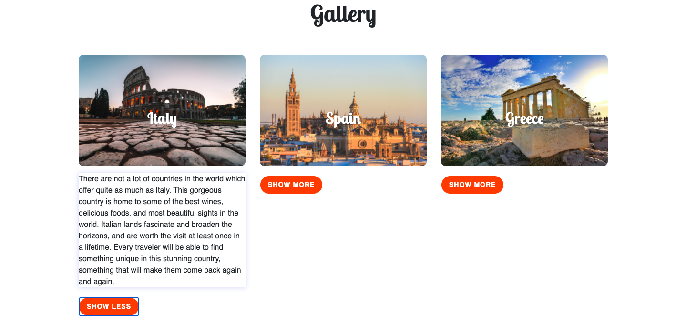
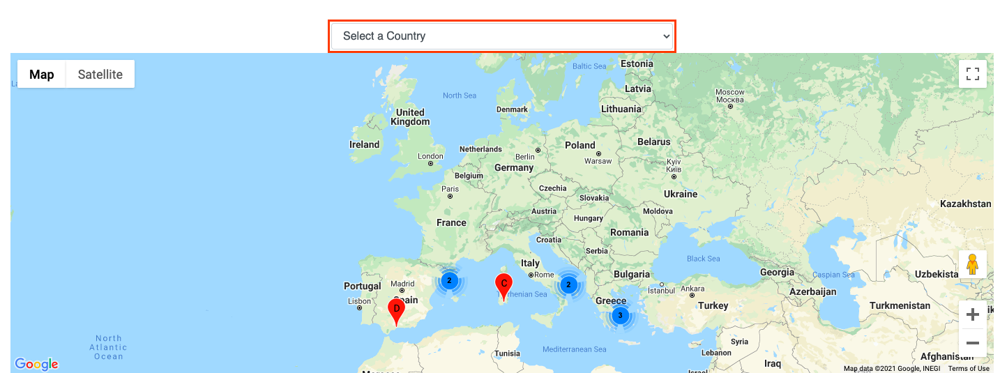
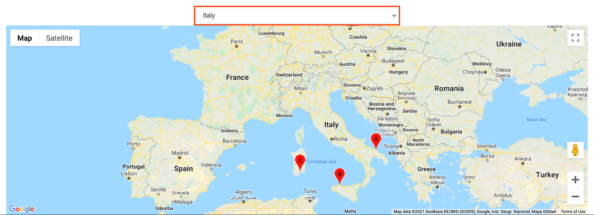
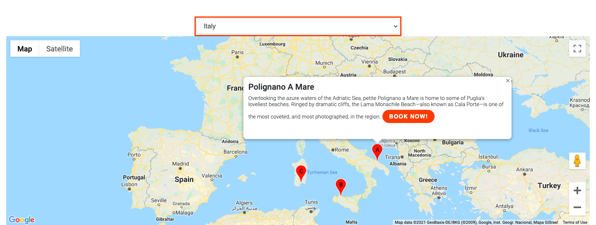
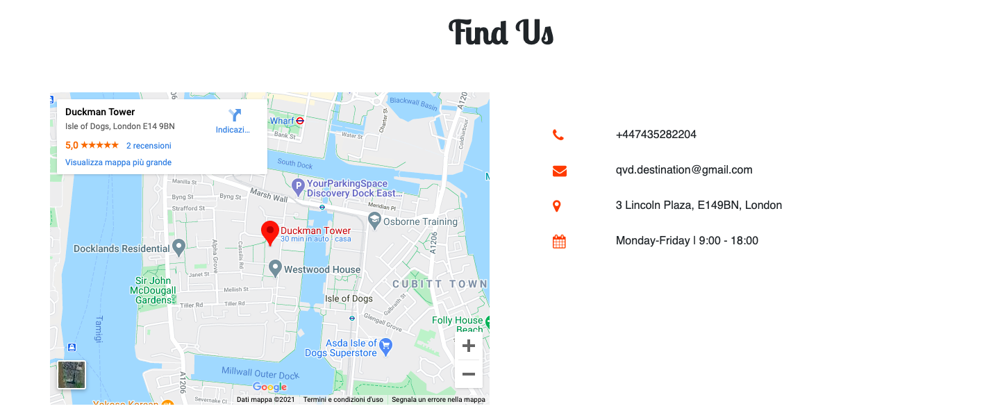
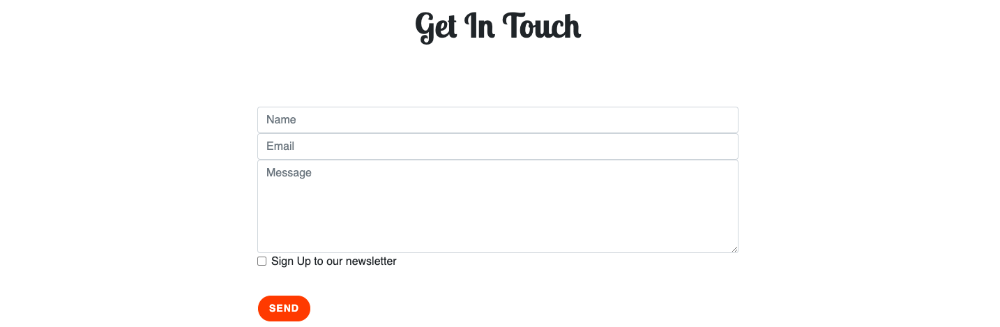

# Book a travel package directly from the website and find useful informations about the destinations.

1. Go on the homepage
2. Scroll down to the bucket list
3. Find the different travel packages
4. Click on the "book now" button to be redirected on the booking page
5. Click on "Read More" button to learn more about the travel destinations

# Find a contact section in the homepage

1. Go on the homepage
2. Scroll down to the "contact" section
3. Click on the "contact us" button to be redirected to the contact page

# Find a gallery section that will show me more about a Country of destination.

1. Go on the homepage
2. Scroll down to the gallery section
3. Click on the "show more" button to discover more about the Country of destination

# Finf the locations on the google map and filter the results based on the Country the user whish to travel to. 

1. Go on the homepage
2. Scroll down to the map section
3. Find the destination on the map
4. Use the the form to filter the destination based on the Country of destination

# Find additional info about the locations on the map and be redirected to the page where the user can make the booking directly from the map.

1. Go on the homepage
2. Scroll down to the map section
3. Find the destination on the map
4. Click on the markers
5. Find additional information about the locations
6. Click on the "book now" button to be redirected to the booking page

# Find social media links

1. On both homepage and contact page
2. Scroll all the way down to the bottom
3. Find social media links on the footer section

# Find out where QVD is located as well as finding other useful info

1. Go on the contact page
2. Find map in the "find us" section
3. Next to the map the user will find a list of other useful info

# Find a contact form fully functional

1. Go on the contact page
2. Scroll down to the "get in touch" section
3. Here the user will find a contact form fully functional

# Easy to scroll website with a back to top button

1. On both homepage and contact page
2. On the ight hand side, at the bottom, find the back to top button

